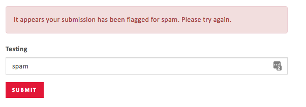
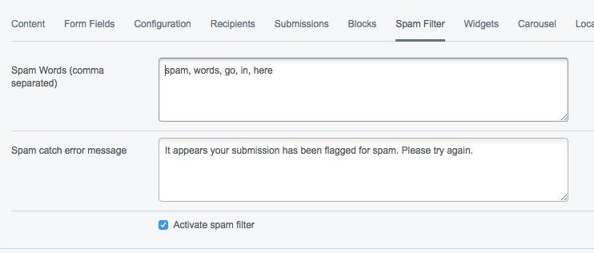

# silverstripe-ufspamfilter
A customisable spam filter for SilverStripe Userforms.

## Requirements
[SilverStripe ^3.1](https://github.com/silverstripe/silverstripe-cms/tree/3)

[SilverStripe Userforms >=3.1 < 4.3](https://github.com/silverstripe/silverstripe-userforms/)

## How to install

### Composer
```composer require "quadra-digital/silverstripe-ufspamfilter":"^1.0.0"```

### Manually
- Download the code base by either cloning this repository or downloading the provided .zip file
- Download the dependencies listed in requirements
- Install module into your site's root directory

### Configuration
Run ```dev/build``` && ```?flush=all```
You should now see a 'spam filter' tab available on your userform.
Add a comma separated list of desired spam words, activate the spam filter and add a custom error message for when spam is caught.

### Front-end spam catch


### CMS setup


## License
This module uses the BSD-3-Clause license. See the [LICENSE.md](LICENSE.md) file for the full license.

## Copyright
Copyright (c) 2017, [Quadrahedron Limited](https://www.quadradigital.co.uk) All rights reserved.

## Contact
This module is built by [Quadra Digtial](https://www.quadradigital.co.uk) and has been made open source for free, we are unlikely to be able to offer much support however if you have any queries regarding usage, licensing, bugs or improvements - please use one of the appropriate contacts below.

### Technical
Jack O'Connor <jack.oconnor@quadradigital.co.uk>

### Administrative
Ping Ho <ping.ho@quadradigital.co.uk>
